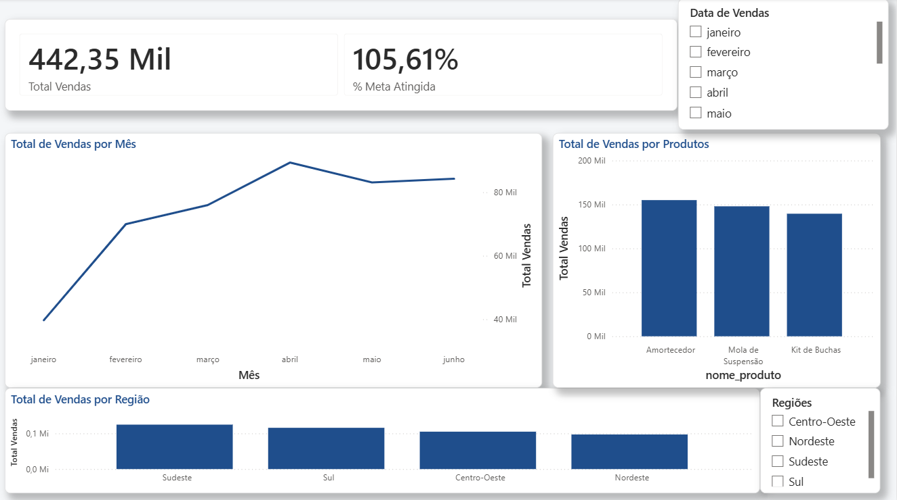

# Sales Dashboard | Power BI & PostgreSQL

## Overview

This project presents an interactive sales dashboard developed with Microsoft Power BI, using PostgreSQL as the data source.

The dashboard was designed to transform sales data into clear and interactive visual insights, providing an overview of sales performance across different products, regions, and periods.

---

## Project Objective

The main objective of this project is to analyze sales performance through key performance indicators and interactive visualizations.

The dashboard provides a consolidated view of sales results and allows users to explore the data from different perspectives.

---

## Technologies

- PostgreSQL
- Power BI
- Power Query
- DAX

---

## Data Model

The project uses a dimensional data model composed of a central sales fact table and supporting dimension tables.

### Main Tables

- `fact_sales` — Contains sales transactions and performance metrics
- `dim_product` — Contains product information
- `dim_region` — Contains regional information

The data model allows sales performance to be analyzed by product, region, and time.

---

## Dashboard

The dashboard provides insights into:

- Total Sales
- Sales Target Achievement
- Monthly Sales Performance
- Sales by Product
- Sales by Region

Interactive filters allow users to explore the data and analyze sales performance from different perspectives.

---

## Dashboard Preview



---

## Repository Structure

```text
sales-dashboard-powerbi/
│
├── dashboard/
│   └── sales-dashboard.pbix
│
├── images/
│   └── sales-dashboard-overview.png
│
├── data/
│   ├── dim_product.csv
│   ├── dim_region.csv
│   └── fact_sales.csv
│
├── sql/
│   └── README.md
│
└── README.md
